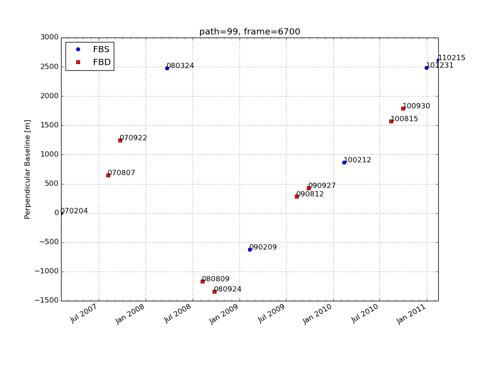
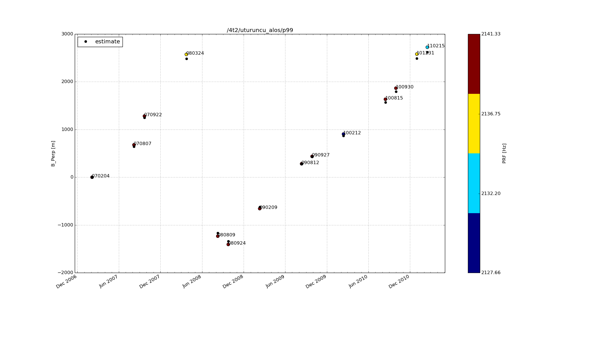

ALOS Scripts
=============

The following Python scripts are helpful if you're processing ALOS data with [ROI_PAC](www.roipac.org). Followed in sequence, they do the following:

1. Estimate baselines for achived frames
2. Set up directory structure with downloaded frames for ROI_PAC processing
3. Calculate more accurate baselines with ROI_PAC 

#In more detail:

##estimate_alos_baselines.py
Search for available data at the Japanese Space Agency 'ALOS User Interface Gateway' [AUIG](https://auig.eoc.jaxa.jp/auigs/). Login as '*Guest*' in upper left panel, then click on `Order and Obs. Requests`. In the map search interface be sure to select the following:

* SearchType    = Archives
* Sensor        = PALSAR
* Ope. Mode     = FBS, FBD

After search completes, select all the scenes from *a single path*, click the `Option` button in the bottom right, and then `CSV`. This will export a spreadsheet file that is read by the script.

```
estimate_alos_baselines.py search.csv
```

The script outputs the file *baselines.txt*, and generates a plot of estimated baselines with dates colored by FBD or FBS acquisition style:



**Note that estimated baselines are generally within 200m of ROI_PAC calculation**


##do_make_raw_alos.py
Assuming you've selected the scenes you want and downloaded them from the [Alaska Satellite Facility Archives](https://ursa.asfdaac.alaska.edu). You're now ready to generate 'raw' files in the directory structure required by ROI_PAC. With ALOS, you need to keep track of FBS or FBD acquisitions... This script does all that. Just run it in the directory with all zip files (e.g. /data/alos/p420):

```
do_make_raw_alos.py
```


##get_roi_baselines.py
With raw files generate in each date folder, you can now run this to output a file called *dolist.in* that has perpendicular baselines compared to a master date (typically the earliest one). The script simply calls the ROI_PAC command `process_2pass.pl [pair] raw orbbase` for each date pair:

```
get_roi_baselines.py 070721
```


##plot_alos_baselines.py
You're now ready to start [making interferograms with ROI_PAC](http://www.geo.cornell.edu/eas/PeoplePlaces/Faculty/matt/flowchart.html). First, though, it's helpful to generate another baseline plot with the perpendicular baseline values actually calculated by ROI_PAC. This plot will have the additional information of the Pulse Repition Frequency (PRF) for each date. Here is an example with the estimated values also included so you can see the general agreement:

 


